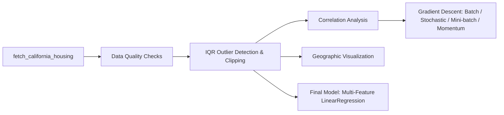
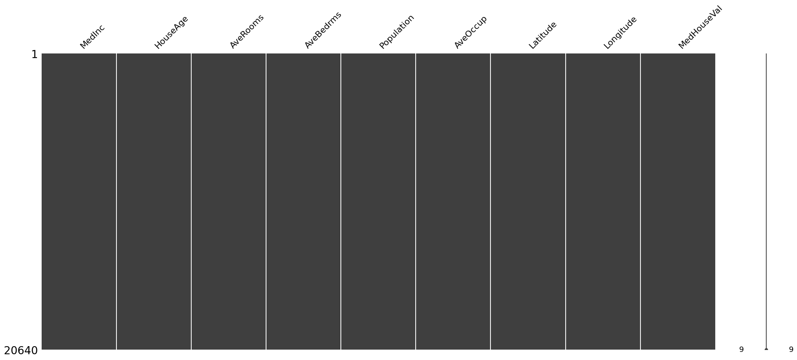
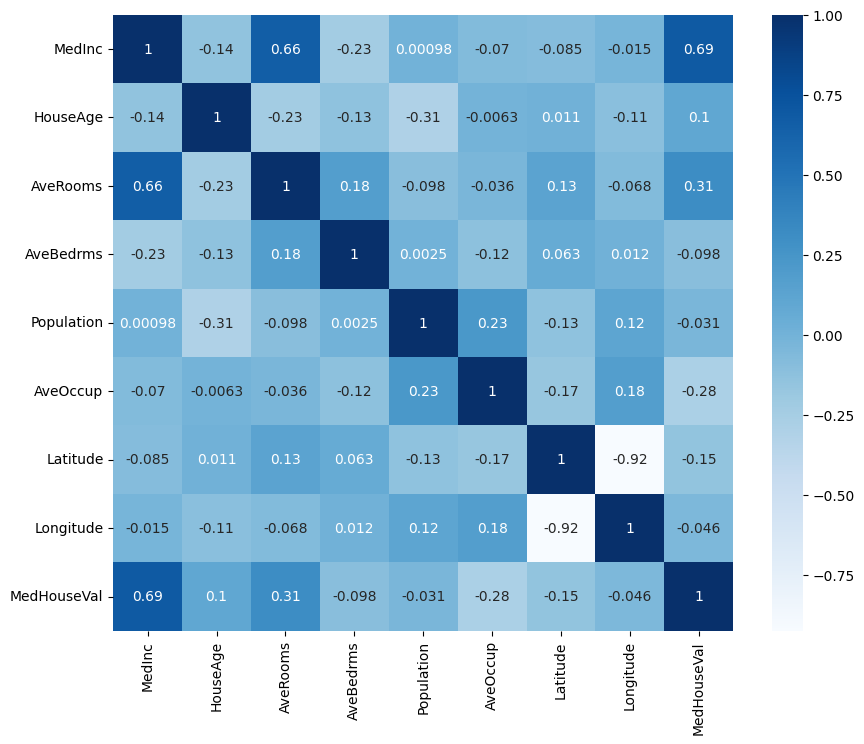
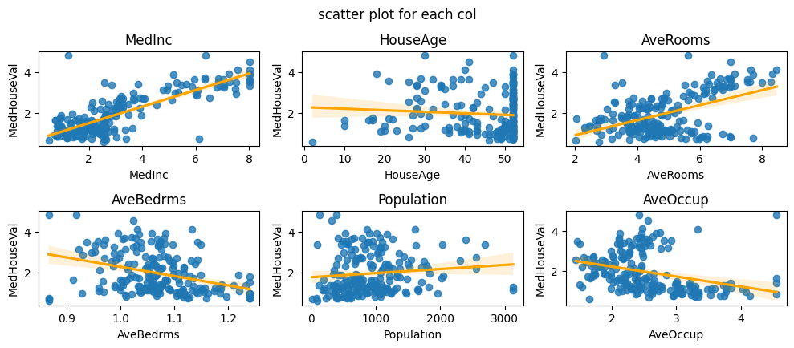
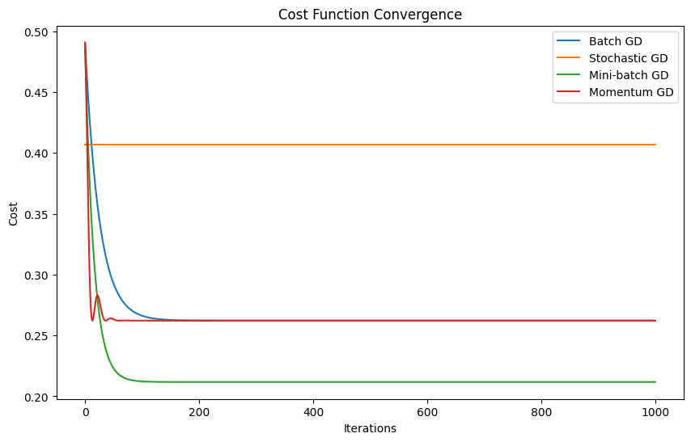

# California Housing Price Analysis

Exploratory data analysis of the classic California Housing dataset, paired with a from-scratch implementation of four gradient descent variants — built to understand *how* linear regression converges, not just to call `.fit()`.

> **Best result: R² = 0.650, RMSE ≈ $66,510** on held-out test data — a verified multi-feature linear regression baseline (section 7 of the notebook).

## Project Overview

This project analyzes the 1990 California census housing dataset (20,640 block groups) to understand which factors drive median house value, then uses that understanding to train a simple linear model with a hand-written gradient descent optimizer — comparing batch, stochastic, mini-batch, and momentum update rules on the same data. It closes with a real multi-feature linear regression baseline so the notebook ends with an actual held-out score, not just a qualitative optimizer comparison.

## Tech Stack

- **Python** — pandas, NumPy
- **Visualization** — Matplotlib, Seaborn, Plotly (Mapbox), missingno
- **Data source** — `sklearn.datasets.fetch_california_housing` (built into scikit-learn, no external file needed)

## Architecture



## Features

- Missing-value and duplicate checks before any transformation
- IQR-based outlier detection with before/after boxplots and skew comparison
- Correlation matrix + per-feature scatter plots against the target
- **From-scratch gradient descent** — batch, stochastic, mini-batch, and momentum variants implemented in plain NumPy, compared by convergence curve
- Geographic scatter map (Plotly Mapbox) of price by location and house age
- **Final multi-feature model** — a plain `LinearRegression` on all 8 features, evaluated on a held-out test split (R² = 0.650), so the notebook ends with a real score

## Testing

No automated test suite — this is an analysis notebook. The from-scratch gradient descent is validated by comparing its cost-convergence behavior against the expected theoretical ordering (momentum ≤ batch < mini-batch < stochastic in stability); the final multi-feature model is validated by an actual held-out train/test split, and the R² = 0.650 result was confirmed by an independent re-run, not just the notebook's own stored output.

## Folder Structure

```
california-housing-price-analysis/
├── california_housing_price_analysis.ipynb
├── README.md
└── screenshots/
    ├── histograms.png
    ├── correlation-heatmap.png
    ├── scatter-relationships.png
    └── geographic-price-map.png
```

## How to Run the Project

1. Install dependencies:
   ```bash
   pip install pandas numpy matplotlib seaborn scikit-learn plotly missingno
   ```
2. Open `california_housing_price_analysis.ipynb` in Jupyter, or click the Colab badge at the top of the notebook.
3. Run all cells top to bottom — the dataset downloads automatically via scikit-learn, no manual data upload needed.

## Future Improvements

- Swap the multi-feature baseline for a gradient-boosted model (XGBoost/LightGBM) — California Housing typically reaches R² in the 0.80-0.85 range with a tuned tree ensemble, well above this linear baseline's 0.650
- Add polynomial/interaction terms (e.g. `MedInc²`, `Latitude`×`Longitude`) to the linear baseline
- Add k-fold cross-validation to the gradient descent comparison
- Cluster `Latitude`/`Longitude` into regions as a categorical feature
- Cross-check the hand-rolled optimizer against `sklearn.linear_model.SGDRegressor`

## Screenshots

**Feature distributions:**



**Correlation matrix:**



**Feature vs. target relationships:**



**Geographic price distribution:**



## Social Links

- **Portfolio:** [abdelrhman-hesham.vercel.app](https://abdelrhman-hesham.vercel.app)
- **LinkedIn:** [linkedin.com/in/abdelrhman-hesham11](https://www.linkedin.com/in/abdelrhman-hesham11/)
- **Email:** abdelrhmanhesham030@gmail.com
