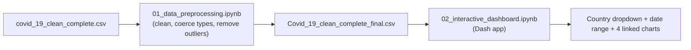
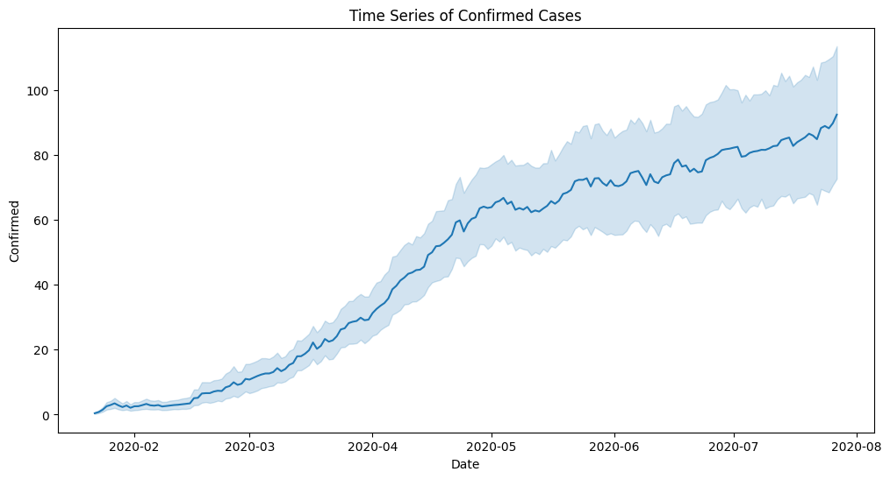
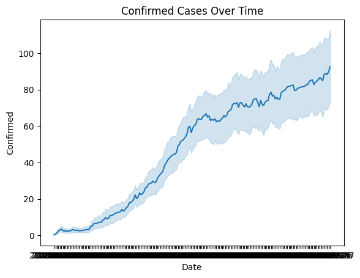
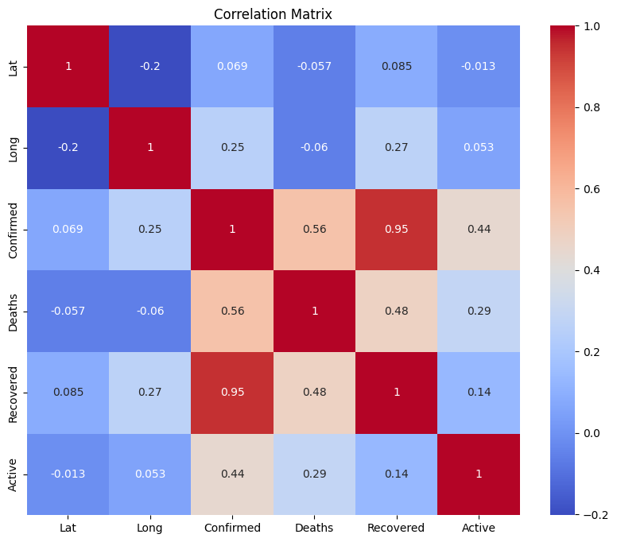

# COVID-19 Data Pipeline & Dashboard

A two-notebook pipeline: clean a 49,000-row COVID-19 dataset, then explore it through an interactive Dash dashboard with country and date-range filtering.

> **No accuracy/R² here by design** — this is a data-cleaning pipeline and dashboard, not a predictive model. The scale metric that matters: 49,068 raw rows cleaned down to 24,590 after outlier removal, feeding a live-filterable dashboard across 187 countries.

## Why I Built This

Every other notebook in this collection ends with a model and a score. This one deliberately doesn't, because not every real data problem is a prediction problem — sometimes the actual work, and the actual value, is turning 49,000 rows of messy, differently-typed, outlier-riddled COVID case data into something a person can just *look at* and trust. I built this to practice that muscle on purpose: the discipline of cleaning data properly and proving it (before/after statistics, not just a claim that it's "cleaned"), then handing it to a dashboard where a country dropdown and a date range are the whole interface.

Nearly half the raw rows get removed in the outlier pass, and I kept that number in this README instead of hiding it, because a data pipeline that quietly drops 50% of its input needs to say so — that's the kind of transparency I want every dataset I touch to have, prediction model or not.

## Project Overview

This project splits cleanly into two stages: **preprocessing** (missing values, type coercion, IQR outlier removal, producing a clean CSV) and a **dashboard** (an interactive Dash app reading that clean CSV) with a country dropdown, date-range picker, and four linked time-series charts — confirmed, deaths, recovered, and active cases.

## Tech Stack

- **Python** — pandas, NumPy
- **Dashboard** — Dash, JupyterDash, Plotly Express
- **Visualization** — Matplotlib, Seaborn
- **Data source** — [Kaggle: COVID-19 Dataset](https://www.kaggle.com/datasets/imdevskp/corona-virus-report)

## Architecture



## Features

- Missing-value handling, type coercion, duplicate removal
- IQR-based outlier removal on Confirmed/Deaths/Recovered/Active
- Per-country death-rate and recovery-rate aggregation
- Interactive Dash dashboard: country selector (defaults to "World", summed across all countries), date-range picker, and 4 linked line charts

## Testing

No automated tests. The preprocessing notebook prints before/after summary statistics so the effect of outlier removal is directly visible; the dashboard was interactively exercised (country switching, date-range changes) to confirm the callback updates all four charts correctly.

## Folder Structure

```
covid19-data-pipeline-dashboard/
├── 01_data_preprocessing.ipynb
├── 02_interactive_dashboard.ipynb
├── README.md
└── screenshots/
    ├── confirmed-cases-timeseries.png
    ├── confirmed-cases-after-cleaning.png
    └── correlation-matrix.png
```

## How to Run the Project

1. Install dependencies:
   ```bash
   pip install pandas numpy matplotlib seaborn dash jupyter-dash plotly
   ```
2. Download the dataset from the [Kaggle page](https://www.kaggle.com/datasets/imdevskp/corona-virus-report) (`covid_19_clean_complete.csv` at minimum) and place it alongside the notebooks.
3. Run `01_data_preprocessing.ipynb` first — it produces `Covid_19_clean_complete_final.csv`.
4. Run `02_interactive_dashboard.ipynb` — in Colab/Jupyter this renders inline; running as a plain script, use `app.run(debug=True)` and open the printed local URL.

## Future Improvements

- Extend cleaning to the companion Kaggle files (US county-level detail, pre-aggregated worldometer snapshot)
- Add a log-scale toggle for the case-count charts
- Deploy the dashboard (Render/Railway free tier) instead of only running inline in a notebook

## Screenshots

**Confirmed cases over time:**



**Confirmed cases after cleaning:**



**Correlation matrix:**



## Social Links

- **Portfolio:** [abdelrhman-hesham.vercel.app](https://abdelrhman-hesham.vercel.app)
- **LinkedIn:** [linkedin.com/in/abdelrhman-hesham11](https://www.linkedin.com/in/abdelrhman-hesham11/)
- **Email:** abdelrhmanhesham030@gmail.com
