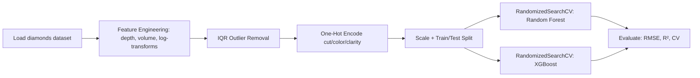
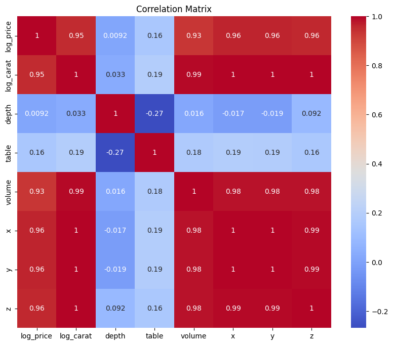
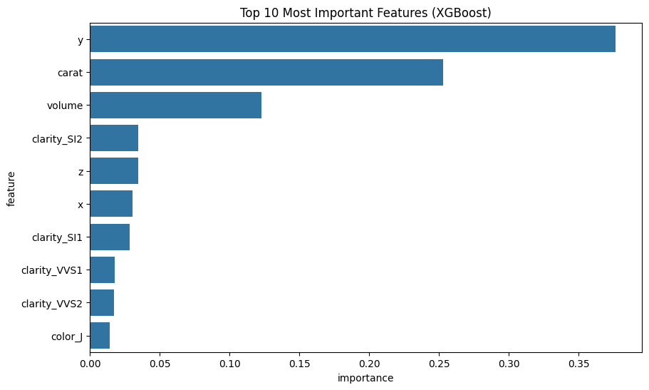
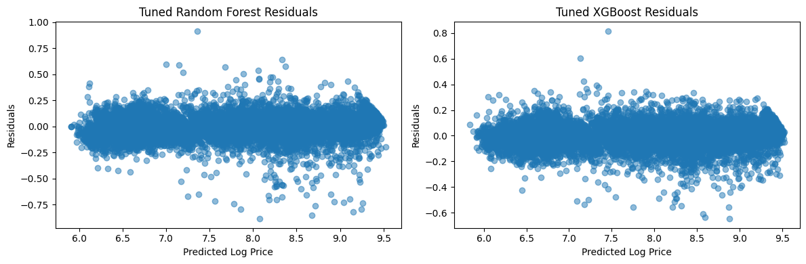
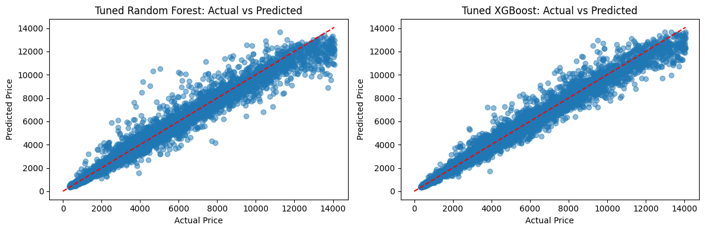

# Diamond Price Prediction

Predicting diamond prices from the classic `diamonds` dataset using tuned Random Forest and XGBoost regressors, with feature engineering, log-transformed targets, and IQR-based outlier removal.

> **Best result: R² = 0.992 (XGBoost, log scale) · RMSE ≈ $428** on held-out test data — verified by an actual re-run of the notebook, not copied from an earlier draft.

## Project Overview

This project builds and compares two tuned regression models — Random Forest and XGBoost — to predict diamond prices from their physical and grading attributes (carat, cut, color, clarity, dimensions). It covers the full pipeline: feature engineering, outlier handling, hyperparameter search, cross-validation, and residual analysis, and is honest about where the models are less stable (see Testing below).

## Tech Stack

- **Python** — pandas, NumPy
- **Modeling** — scikit-learn (`RandomForestRegressor`, `RandomizedSearchCV`), XGBoost
- **Visualization** — Matplotlib, Seaborn
- **Data source** — `seaborn.load_dataset("diamonds")` (53,940 rows, no file download needed)

## Architecture



## Features

- Feature engineering: `depth` ratio and `volume` from physical dimensions, log-transformed `price`/`carat`/`volume`
- IQR-based outlier removal (factor 2.0) across all numeric predictors
- One-hot encoding of categorical grade columns (`cut`, `color`, `clarity`)
- Hyperparameter tuning via `RandomizedSearchCV` (10 iterations, 5-fold CV) for both Random Forest and XGBoost
- Feature importance ranking, residual plots, and actual-vs-predicted visualization

## Testing

No unit tests — model quality is validated via held-out test-set RMSE/R² plus 5-fold cross-validation. **Reported honestly:** the cross-validation R² has a wide spread across folds (Random Forest ±0.52, XGBoost ±0.36), meaning per-fold performance is inconsistent — noted directly in the notebook rather than only reporting the mean.

## Folder Structure

```
diamond-price-prediction/
├── diamond_price_prediction.ipynb
├── README.md
└── screenshots/
    ├── correlation-matrix.png
    ├── feature-importance.png
    ├── residuals.png
    └── actual-vs-predicted.png
```

## How to Run the Project

1. Install dependencies:
   ```bash
   pip install pandas numpy matplotlib seaborn scikit-learn xgboost
   ```
2. Open `diamond_price_prediction.ipynb` in Jupyter, or click the Colab badge at the top of the notebook.
3. Run all cells top to bottom — the dataset loads directly via `seaborn.load_dataset("diamonds")`, no manual upload needed.

## Future Improvements

- Widen the `RandomizedSearchCV` search (more iterations, or switch to Bayesian optimization) to reduce cross-validation variance
- Use a stratified k-fold by price quantile so each fold sees a similar price distribution
- Add SHAP values for per-prediction explainability
- Ensemble Random Forest + XGBoost and check whether the blend beats either alone

## Screenshots

**Correlation matrix:**



**Feature importance (XGBoost):**



**Residuals:**



**Actual vs. predicted:**



## Social Links

- **Portfolio:** [abdelrhman-hesham.vercel.app](https://abdelrhman-hesham.vercel.app)
- **LinkedIn:** [linkedin.com/in/abdelrhman-hesham11](https://www.linkedin.com/in/abdelrhman-hesham11/)
- **Email:** abdelrhmanhesham030@gmail.com
