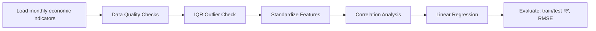
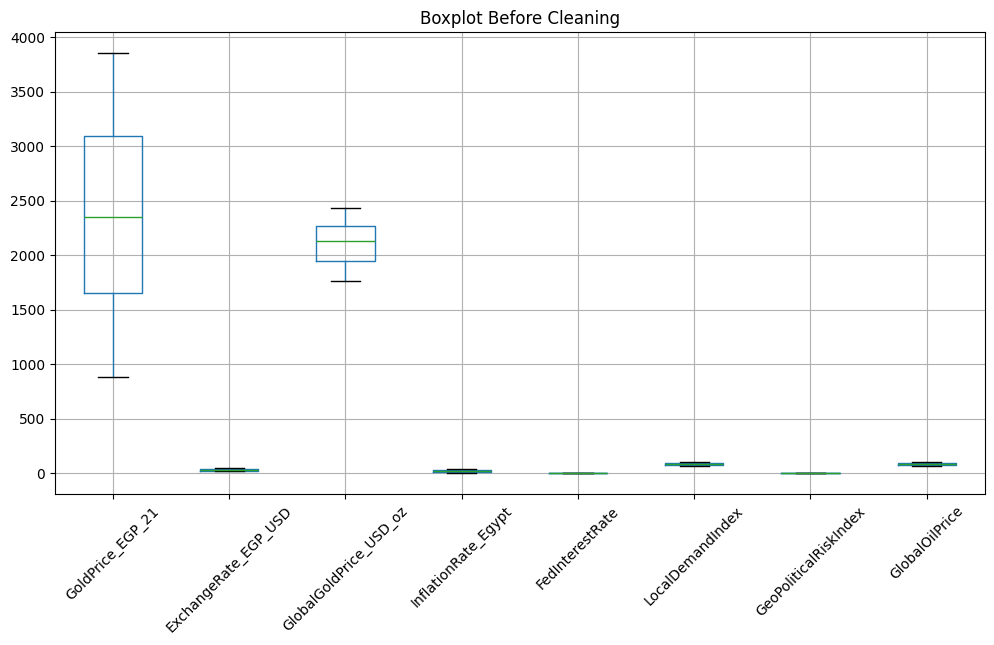
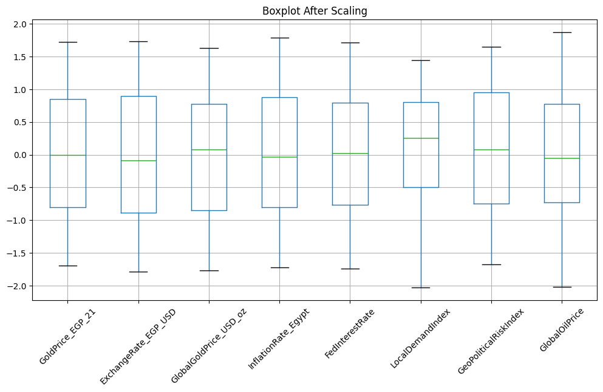
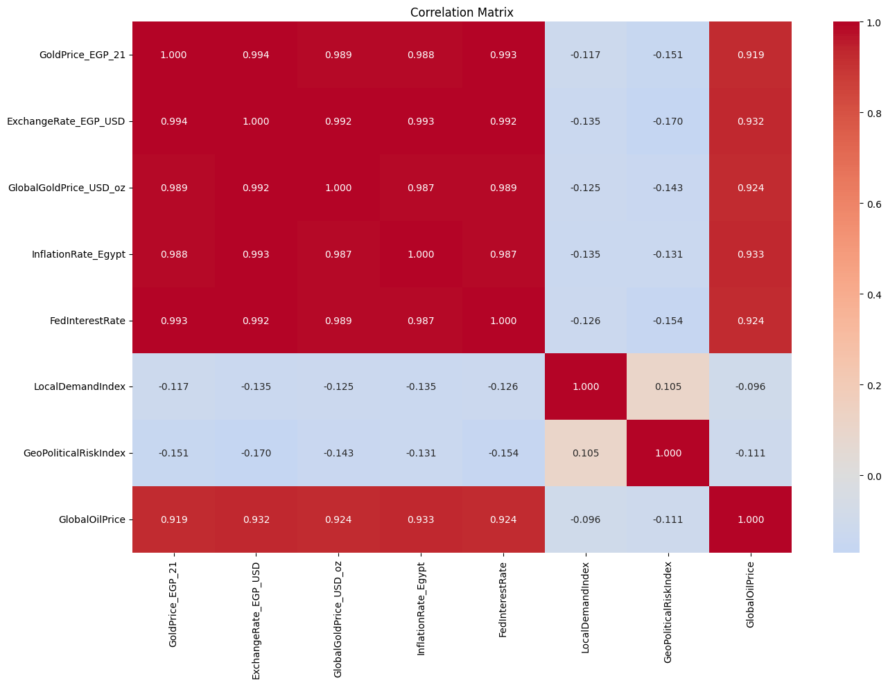

# Egypt Gold Price Forecasting

Linear regression forecasting the local Egyptian gold price from macroeconomic indicators — exchange rate, global gold price, inflation, Fed interest rate, local demand, geopolitical risk, and oil price.

> **Best result: test R² = 0.980, RMSE ≈ 105 EGP** — read the honest caveat about sample size (48 rows) in [Testing](#testing) before treating this as more than a promising signal.

## Why I Built This

Gold prices in Egypt are something I've watched people actually argue about — is it the dollar exchange rate, is it global gold, is it just local demand spiking before a holiday? Everyone has an opinion and nobody has a number. There was no ready-made dataset for this, so the project started with me assembling one by hand, month by month, from public exchange-rate, inflation, and gold-price sources — which is also exactly why it's only 48 rows, and why I don't get to pretend that's a large-sample result.

That's the real reason this README leads with a caveat instead of just the R². A 0.980 test R² on 48 rows is a promising signal that the macro variables I picked matter, not proof the model generalizes — and I'd rather someone read that as a well-scoped first pass on a real question than as a bigger claim than the data supports.

## Project Overview

This project explores which macroeconomic factors drive the local 21-karat gold price in Egypt, then fits a linear regression to quantify the relationship. The dataset is a small, self-assembled monthly panel (48 rows) — the project is explicit about the limits that come with that sample size rather than overstating the result.

## Tech Stack

- **Python** — pandas, NumPy
- **Modeling** — scikit-learn (`LinearRegression`, `StandardScaler`)
- **Visualization** — Matplotlib, Seaborn

## Architecture



## Features

- Data quality checks (nulls, duplicates) on a small (48-row) monthly panel
- IQR-based outlier detection and before/after scaling boxplots
- Correlation analysis against the target, ranking which macro indicators matter most
- Linear regression with standardized features, evaluated on a held-out test split
- Honest discussion of small-sample limitations in the results section

## Testing

No unit tests. Model evaluation uses a held-out 20% test split (train R² 0.993, test R² 0.980, RMSE ≈ 105 EGP). With only ~48 rows total, the test set is roughly 10 points — the notebook flags this directly rather than presenting the R² as a validated production result.

## Folder Structure

```
egypt-gold-price-forecasting/
├── egypt_gold_price_forecasting.ipynb
├── README.md
└── screenshots/
    ├── boxplot-before-cleaning.png
    ├── boxplot-after-scaling.png
    └── correlation-matrix.png
```

## How to Run the Project

1. Install dependencies:
   ```bash
   pip install pandas numpy matplotlib seaborn scikit-learn
   ```
2. This project's dataset (`gold_egypt_dataset.csv`) is a small, self-assembled dataset that is **not included** in this repository. To run the notebook, assemble a CSV with the columns documented in the notebook's introduction (date, gold price, exchange rate, global gold price, inflation, Fed interest rate, local demand index, geopolitical risk index, oil price).
3. Open `egypt_gold_price_forecasting.ipynb` in Jupyter, or click the Colab badge at the top of the notebook.

## Future Improvements

- Collect a longer time series for a proper train/validation/test split
- Add lag features — this is fundamentally a time series, and the current model doesn't use that structure
- Compare against a simple ARIMA/Prophet baseline on `GoldPrice_EGP_21` alone
- Regularize (Ridge/Lasso) once more data is available, given how correlated the macro features are with each other

## Screenshots

**Boxplot before cleaning:**



**Boxplot after scaling:**



**Correlation matrix:**



## Social Links

- **Portfolio:** [abdelrhman-hesham.vercel.app](https://abdelrhman-hesham.vercel.app)
- **LinkedIn:** [linkedin.com/in/abdelrhman-hesham11](https://www.linkedin.com/in/abdelrhman-hesham11/)
- **Email:** abdelrhmanhesham030@gmail.com
