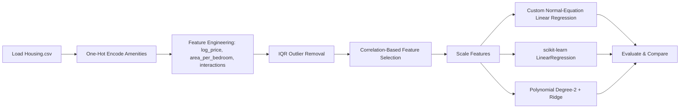
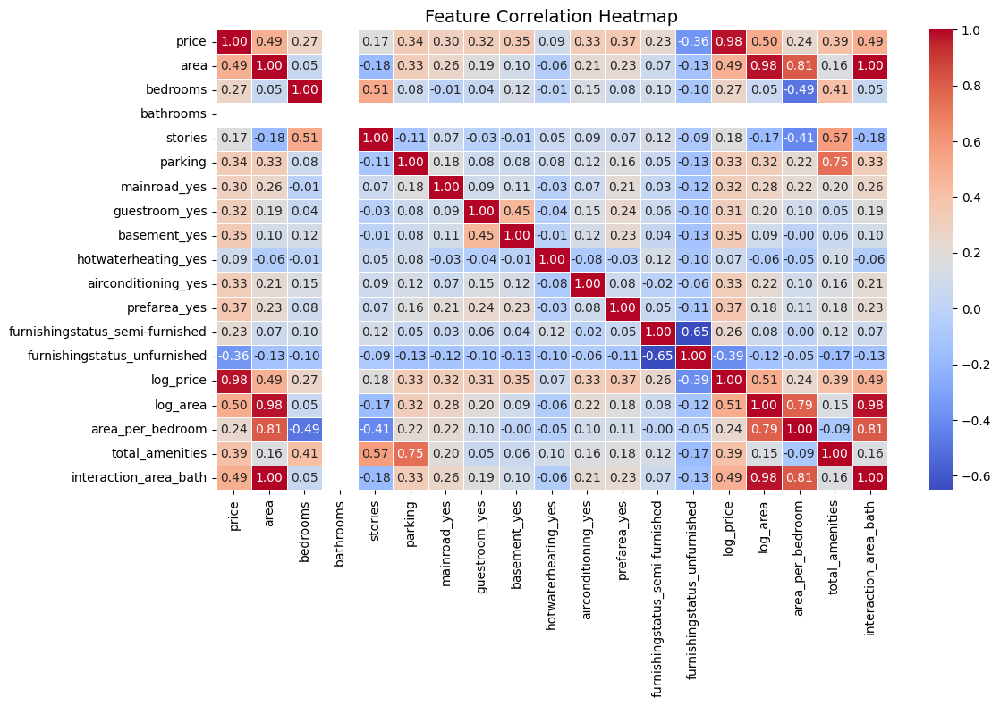
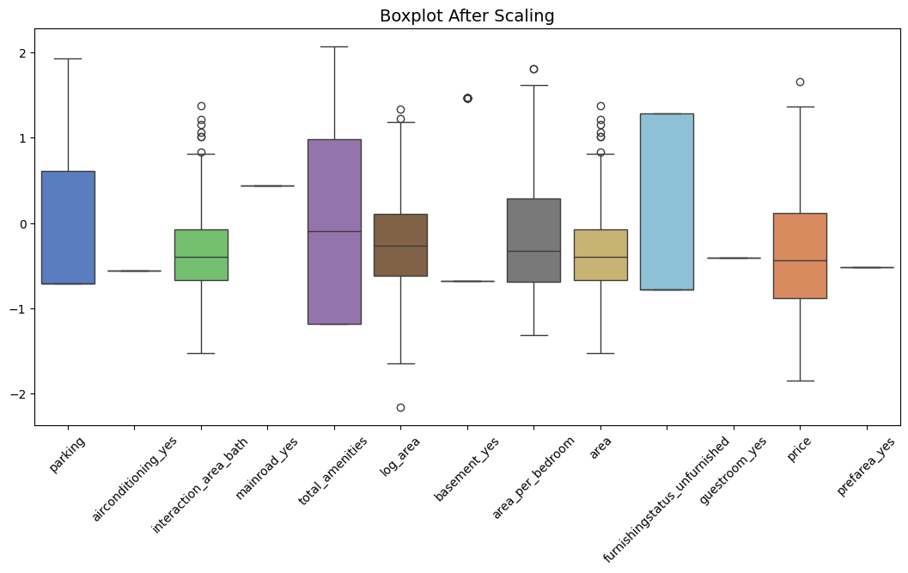
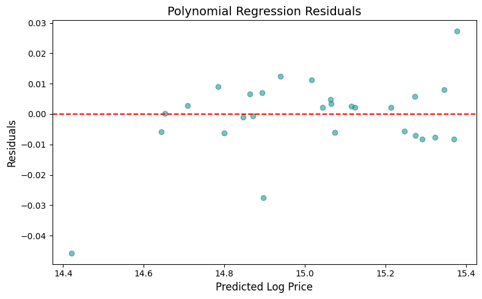

# Housing Price Prediction

Predicting house prices from the Kaggle Housing Prices dataset, comparing a from-scratch normal-equation linear regression against scikit-learn's implementation and a degree-2 polynomial + Ridge model.

> **Best result: R² = 0.9974** (degree-2 polynomial + Ridge) · **MAE ≈ $27,985** on held-out test data.

## Why I Built This

After writing a from-scratch gradient-descent optimizer for the [California Housing project](../california-housing-price-analysis/), I wanted to answer the harder question that iterative optimization sidesteps: does my model actually converge to the *correct* answer, or just to *an* answer? Gradient descent gets you close over enough steps; the normal equation gets you the exact closed-form solution in one shot. So here I implemented that closed form myself and checked it against scikit-learn's `LinearRegression` on the identical split — not "does it seem plausible," but do the two agree to four decimal places of R². They did (0.9752 both), and that agreement is the actual proof my linear algebra was right, not just my code running without an error.

Only after that verification did I let myself reach for the polynomial + Ridge model that gets the better score. Confirming the simple version was correct first is what made trusting the more complex version afterward reasonable.

## Project Overview

This project builds three regression models on a 545-listing housing dataset — a hand-written linear regression solving the normal equation directly, scikit-learn's `LinearRegression` as a validation baseline, and a degree-2 polynomial + Ridge model for the non-linear case. The from-scratch model is checked against scikit-learn's rather than assumed correct.

## Tech Stack

- **Python** — pandas, NumPy
- **Modeling** — scikit-learn (`LinearRegression`, `Ridge`, `PolynomialFeatures`)
- **Visualization** — Matplotlib, Seaborn, Plotly
- **Data source** — [Kaggle: Housing Prices Dataset](https://www.kaggle.com/datasets/yasserh/housing-prices-dataset)

## Architecture



## Features

- One-hot encoding of 7 binary/categorical amenity columns
- 5 engineered features: log-price, log-area, area-per-bedroom, total amenities, area×bathrooms interaction
- Two-stage IQR outlier removal (pre- and post-scaling)
- Correlation-based feature selection (|r| > 0.3 to price, plus all engineered features)
- **From-scratch `LinearRegression` class** solving the normal equation directly, validated against scikit-learn's implementation
- Degree-2 polynomial regression with Ridge regularization as the strongest model

## Testing

No unit tests — model correctness is validated by comparing the from-scratch linear regression's R²/MAE against scikit-learn's `LinearRegression` on the identical train/test split. They agree to 4 decimal places of R² (0.9752 vs 0.9752), which is the actual verification that the custom implementation is correct.

## Folder Structure

```
housing-price-prediction/
├── housing_price_prediction.ipynb
├── README.md
└── screenshots/
    ├── correlation-heatmap.png
    ├── actual-vs-predicted.png
    └── residuals.png
```

## How to Run the Project

1. Install dependencies:
   ```bash
   pip install pandas numpy matplotlib seaborn scikit-learn plotly
   ```
2. Download `Housing.csv` from the [Kaggle dataset page](https://www.kaggle.com/datasets/yasserh/housing-prices-dataset) and place it alongside the notebook (or update the path in the first cell).
3. Open `housing_price_prediction.ipynb` in Jupyter, or click the Colab badge at the top of the notebook, and run all cells.

## Future Improvements

- Add a tree-based model (Random Forest / XGBoost) as a non-parametric comparison point
- Cross-validate the polynomial degree and Ridge `alpha` instead of using fixed values
- Investigate residual behavior at the high-price tail, where the linear/polynomial models tend to underfit
- Extend the custom `LinearRegression` class with an iterative gradient-descent solver, mirroring the [California Housing project](../california-housing-price-analysis/)'s approach

## Screenshots

**Correlation heatmap:**



**Actual vs. predicted:**



**Residuals (polynomial model):**



## Social Links

- **Portfolio:** [abdelrhman-hesham.vercel.app](https://abdelrhman-hesham.vercel.app)
- **LinkedIn:** [linkedin.com/in/abdelrhman-hesham11](https://www.linkedin.com/in/abdelrhman-hesham11/)
- **Email:** abdelrhmanhesham030@gmail.com
