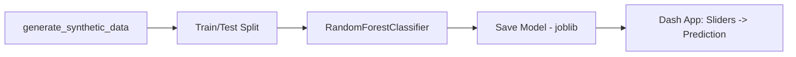

# Laptop Recommendation Dashboard

An interactive Dash app that recommends a laptop model from hardware specs and budget, backed by a Random Forest classifier trained on synthetically generated data.

> **Best result: 98% test accuracy, 99% cross-validated accuracy** — expected to be high since the labels come from a simple deterministic rule (see the note on synthetic data below).

## Project Overview

This project demonstrates a full pipeline — synthetic data generation, model training, and an interactive UI — for a laptop recommendation system. **The data is synthetic**, generated from a simple rule (budget bracket + RAM tier → laptop model, with noise); this is a from-scratch pipeline demo, not a recommendation engine trained on real market data.

## Tech Stack

- **Python** — pandas, NumPy
- **Modeling** — scikit-learn (`RandomForestClassifier`), joblib
- **Dashboard** — Dash, Dash Bootstrap Components

## Architecture



## Features

- Synthetic dataset generator (1,000 rows) with a transparent, documented labeling rule
- `RandomForestClassifier` (200 trees, tuned depth/split params) — 98% test accuracy, 99% cross-validated accuracy
- Model persistence via `joblib`
- Interactive Dash dashboard: sliders for processor tier, RAM, storage, battery life, and budget, with a live-updating recommendation

## Testing

No unit tests. Model quality is reported via train/test accuracy, 5-fold cross-validation, and a full per-class classification report (precision/recall/F1 for each of the 4 laptop classes) — all included directly in the notebook output.

## Folder Structure

```
laptop-recommendation-dashboard/
└── laptop_recommendation_dashboard.ipynb
```

## How to Run the Project

1. Install dependencies:
   ```bash
   pip install pandas numpy scikit-learn dash dash-bootstrap-components joblib
   ```
2. Open `laptop_recommendation_dashboard.ipynb` in Jupyter, or click the Colab badge at the top of the notebook.
3. Run all cells — the dataset is generated in-notebook, no external file needed. The final cell launches the Dash app locally at `http://127.0.0.1:8050`.

## Future Improvements

- Replace synthetic data with a real scraped laptop-listing dataset for an actually useful recommender
- Add a confidence score / top-3 alternatives instead of a single point prediction
- Persist the trained model as a repo release asset instead of regenerating it on every run

## Screenshots

This project ships as an interactive dashboard rather than static charts — run the notebook locally to see the live slider-driven recommendation UI at `http://127.0.0.1:8050`.

## Social Links

- **Portfolio:** [abdelrhman-hesham.vercel.app](https://abdelrhman-hesham.vercel.app)
- **LinkedIn:** [linkedin.com/in/abdelrhman-hesham11](https://www.linkedin.com/in/abdelrhman-hesham11/)
- **Email:** abdelrhmanhesham030@gmail.com
